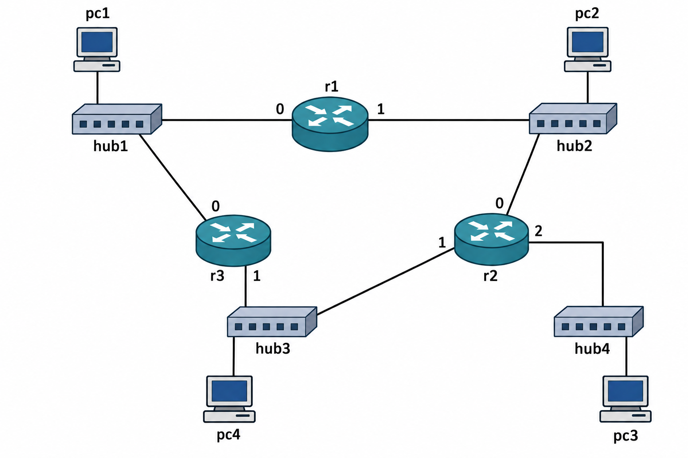

# lab01

{width=12cm}


```
hub1  pc1 (200.0.0.10)
      pc4 (200.0.0.40)
      r1:eth0 (200.0.0.1)
      r3:eth0 (200.0.0.3)

hub2  r1:eth1 (201.0.0.1)
      r2:eth0 (201.0.0.2)

hub3  r2:eth1 (202.0.0.2)
      r3:eth1 (202.0.0.3)
      pc2 (202.0.0.20)

hub4  r2:eth2 (203.0.0.2)
      pc3 (203.0.0.30)
```

Rutas estáticas configuradas en `/etc/network/interfaces` de cada router:

| Router | Red destino    | Via         | Interfaz |
|--------|----------------|-------------|----------|
| r1     | 202.0.0.0/24   | 201.0.0.2   | eth1     |
| r1     | 203.0.0.0/24   | 201.0.0.2   | eth1     |
| r2     | 200.0.0.0/24   | 201.0.0.1   | eth0     |
| r2     | 202.0.0.0/16   | 201.0.0.1   | eth0     |
| r2     | default        | 202.0.0.3   | eth1     |
| r3     | 201.0.0.0/24   | 200.0.0.1   | eth0     |
| r3     | 203.0.0.0/24   | 202.0.0.2   | eth1     |
| r3     | default        | 202.0.0.2   | eth1     |

